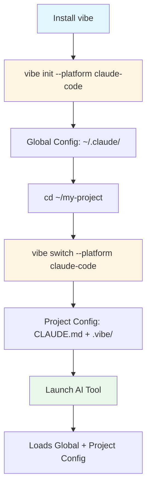

# Claude Code Workflow

**English** | [中文](README.zh-CN.md)

A battle-tested workflow foundation for Claude Code and OpenCode — providing structured configuration, memory management, and consistent development practices.

**Not a tutorial. Not a toy config. A production workflow that actually ships — now with a provider-neutral core spec in phase 1.**

> **📖 New to this project?** Start with [PRINCIPLES.md](PRINCIPLES.md) — mandatory reading for all contributors covering our core philosophy: Production-First, Structure > Prompting, Memory > Intelligence, Verification > Confidence, and Portable > Specific.

## Origin & Fork Status

This project is a fork of [runesleo/claude-code-workflow](https://github.com/runesleo/claude-code-workflow) with substantial architectural refactoring:

- **Original Author**: [@runes_leo](https://x.com/runes_leo)
- **Fork Maintainer**: [@nehcuh](https://github.com/nehcuh)
- **Major Changes**:
  - Modularized CLI into 9 Ruby library modules (`lib/vibe/*.rb`)
  - Added comprehensive unit test suite with 12 test files + benchmarks
  - Integrated SimpleCov for test coverage enforcement (~58% coverage)
  - Removed unused dependency injection container (YAGNI principle)
  - Enhanced error handling with context support
  - Thread-safe YAML loading with mutex protection
  - Command registry pattern for better extensibility
  - Added Chinese documentation (`README.zh-CN.md`)
  - Enhanced overlay system with runtime preference examples (`examples/`)
  - Improved path safety and symlink handling for macOS compatibility
  - Refactored generator architecture for better maintainability

While this fork maintains the original MIT license and credits the original author, the codebase has diverged significantly through refactoring and new features.

## Why This Exists

Claude Code is powerful out of the box, but without structure it becomes a smart assistant that starts fresh each session. This template provides a **structured workflow system** that:

- **Prompts structured memory practices**: Records lessons to markdown files so past mistakes are searchable
- **Organizes context in layers**: Rules (always), docs (reference), memory (working state)
- **Suggests capability-based routing**: Guidelines for matching task complexity to appropriate models
- **Enforces verification checkpoints**: Requires explicit test execution before claiming completion
- **Supports session management**: Structured templates for saving progress when you signal completion
- **Exposes portable skill guidelines**: Rule-based guidance for when to use specific skills (TDD, code review, etc.)

**Important**: This is a configuration template with prompts and rules — not automation. You and your LLM must actively use the structure.

## What's New

### Recent Improvements (2026-03)

- **🎯 Session Management Hook**: Automatically prompts to save progress before `/exit` (Claude Code only)
- **✨ Improved `vibe targets`**: Now shows all supported platforms with clear status indicators
- **🔍 Better overlay warnings**: Clear error messages when using incorrect overlay format
- **🧪 New `--dry-run` mode**: Preview init operations without making changes
- **📚 Enhanced documentation**: New overlay tutorial and troubleshooting guide
- **🐛 Bug fixes**: Fixed project-level configuration generation

### Phase 1-7 Direction: Portable Core + Target Adapters + Generator + Project Overlays + Snapshot Testing

This repo now has two layers of concern:

- `core/` — provider-neutral workflow semantics (model tiers, skill registry, safety policy)
- current runtime files (`rules/`, `docs/`, `memory/`, `skills/`) — the first-class Claude Code target that remains fully usable today
- `targets/` — adapter mappings for Claude Code (active) and OpenCode (exploratory); other platforms planned

**Current Status**:
- ✅ **Phase 1-5 Complete**: Portable core, generator, overlays
- ✅ **Config-Driven Migration**: 2 of 2 active platforms migrated (claude-code, opencode)
- 🚧 **Phase 6-7 Paused**: Focusing on stability before continuing platform expansion

**Architecture Highlights**:
- Configuration-driven platform definitions
- JSON Schema validation for all configs
- Comprehensive CLI with 8 commands
- Project overlay system for customization
- 273 tests with 100% pass rate

## Architecture: Portable Core + Runtime Layers

```text
Portable core
  core/models      -> capability tiers + provider profiles
  core/skills      -> portable skill registry
  core/security    -> severity policy + signal taxonomy
  core/policies    -> portable behavior policies

Project overlay
  .vibe/overlay.yaml or --overlay FILE -> project-specific profile / policy / native config patch

Target adapters
  targets/*.md     -> Antigravity / Claude Code / Codex CLI / Cursor / OpenCode / VS Code / Warp mapping docs

Current first-class runtime target: Claude Code
  Layer 0: rules/  (always loaded)
  Layer 1: docs/   (on demand)
  Layer 2: memory/ (hot data)
  skills/, agents/, commands/ remain host-facing assets during transition

Generator
  bin/vibe         -> build/use portable targets into generated/<target>/
```

**Why this split?** `core/` keeps the semantics portable, while the existing runtime layers keep Claude Code productive right now. That lets you generalize the workflow without throwing away the current working setup.

## What's Inside

```
claude-code-workflow/
├── CLAUDE.md                     # Entry point — Claude reads this first
├── README.md                     # You are here
├── PRINCIPLES.md                 # ⚠️ MANDATORY: Core philosophy & development principles
│
├── bin/
│   ├── vibe                      # Generator CLI (build/use/inspect/overlay-aware targets)
│   ├── vibe-init                 # Integration initialization wizard
│   ├── vibe-smoke                # Smoke test for generator target builds + overlays
│   └── validate-schemas          # JSON schema validation for core/ specs
│
├── lib/vibe/                     # Modularized CLI implementation (22 modules)
│   ├── utils.rb                  # Common utilities (deep merge, I/O, path handling)
│   ├── doc_rendering.rb          # Markdown document rendering
│   ├── overlay_support.rb        # Overlay parsing, discovery, policy merging
│   ├── native_configs.rb         # Native config builders (settings.json, cli.json, etc.)
│   ├── path_safety.rb            # Output path safety guards
│   ├── target_renderers.rb       # 8 target file renderers
│   ├── builder.rb                # Target build orchestration
│   ├── init_support.rb           # Integration detection and setup
│   ├── external_tools.rb         # External tool integration logic
│   ├── integration_manager.rb    # Integration detection and management
│   ├── integration_setup.rb      # Integration setup and configuration
│   ├── integration_verifier.rb   # Integration verification
│   ├── integration_recommendations.rb # Integration recommendations
│   ├── platform_utils.rb         # Platform-related utilities
│   ├── platform_installer.rb     # Platform installation logic
│   ├── platform_verifier.rb      # Platform verification
│   ├── rtk_installer.rb          # RTK installation logic
│   ├── superpowers_installer.rb  # Superpowers installation logic
│   ├── quickstart_runner.rb      # Quickstart setup logic
│   ├── user_interaction.rb       # User prompts and interaction
│   ├── version.rb                # Version information
│   └── errors.rb                 # Custom error classes with context support
│
├── test/                         # Unit test suite (11 test files + benchmarks)
│   ├── test_vibe_cli.rb
│   ├── test_vibe_overlay.rb
│   ├── test_vibe_init.rb
│   ├── test_vibe_utils_validation.rb
│   ├── benchmark/                # Performance benchmarks
│   │   ├── check_coverage.rb     # SimpleCov coverage threshold checker
│   │   ├── utils_benchmark.rb
│   │   └── yaml_loading_benchmark.rb
│   ├── test_vibe_external_tools.rb
│   ├── test_path_overlap_calculation.rb
│   ├── test_cli_path_safety_guards.rb
│   ├── test_vibe_utils.rb
│   ├── test_recommendations.rb
│   └── test_yaml_safety.rb
│
├── schemas/                      # JSON schemas for core/ validation
│   ├── providers.schema.json
│   ├── security.schema.json
│   └── skills.schema.json
│
├── core/                         # Portable SSOT
│   ├── README.md                 # Portable architecture + migration rules
│   ├── models/
│   │   ├── tiers.yaml            # Capability tiers (portable)
│   │   └── providers.yaml        # Target/provider mappings
│   ├── skills/
│   │   └── registry.yaml         # Skill registry + namespace rules
│   ├── security/
│   │   └── policy.yaml           # P0/P1/P2 semantics + target actions
│   ├── policies/
│   │   ├── behaviors.yaml        # Portable behavior policy schema
│   │   ├── task-routing.yaml     # Task complexity routing rules
│   │   └── test-standards.yaml   # Testing coverage requirements
│   └── integrations/
│       ├── README.md             # Integration documentation
│       ├── superpowers.yaml      # Superpowers skill pack metadata
│       └── rtk.yaml              # RTK token optimizer metadata
│
├── targets/                      # Target adapter contracts
│   ├── README.md                 # Shared adapter rules
│   ├── claude-code.md            # Active target (production-ready)
│   ├── opencode.md               # Active target (exploratory)
│   ├── antigravity.md            # Planned target (documentation)
│   ├── codex-cli.md              # Planned target (documentation)
│   ├── cursor.md                 # Planned target (documentation)
│   ├── kimi-code.md              # Planned target (documentation)
│   ├── vscode.md                 # Planned target (documentation)
│   └── warp.md                   # Planned target (documentation)
│
├── .vibe/                        # Generated target support files (tracked)
│   ├── manifest.json             # Target build manifest
│   ├── target-summary.md         # Quick reference
│   └── <target>/                 # Per-target generated docs
│       ├── behavior-policies.md
│       ├── routing.md
│       ├── safety.md
│       ├── skills.md
│       ├── task-routing.md
│       └── test-standards.md
│
├── generated/                    # Build output (gitignored)
│   ├── <target>/                 # Materialized target-specific config
│   └── golden-files/             # Snapshot testing reference files
│
├── examples/
│   ├── node-nvm-overlay.yaml     # Example Node/npm overlay preferring nvm
│   ├── project-overlay.yaml      # Example regulated/review-heavy overlay
│   └── python-uv-overlay.yaml    # Example Python overlay preferring uv
│
├── rules/                        # Layer 0: Always loaded
│   ├── behaviors.md              # Core behavior rules (debugging, commits, routing)
│   ├── skill-triggers.md         # When to auto-invoke which skill
│   └── memory-flush.md           # Auto-save triggers (never lose progress)
│
├── docs/                         # Layer 1: On-demand reference
│   ├── agents.md                 # Multi-model collaboration framework
│   ├── behaviors-extended.md     # Extended rules (knowledge base, associations)
│   ├── behaviors-reference.md    # Detailed operation guides
│   ├── content-safety.md         # AI hallucination prevention system
│   ├── project-overlays.md       # Project-level overlay schema + merge rules
│   ├── scaffolding-checkpoint.md # "Do you really need to self-host?" checklist
│   ├── task-routing.md           # Model tier routing + target profiles
│   └── integrations.md           # External tool integration guide
│
├── memory/                       # Layer 2: Your working state (3-tier architecture)
│   ├── session.md                # Hot layer: daily progress + in-flight tasks
│   ├── project-knowledge.md      # Warm layer: technical pitfalls + patterns
│   └── overview.md               # Cold layer: goals + projects + infrastructure
│
├── skills/                       # Reusable skill definitions
│   ├── session-end/SKILL.md              # Auto wrap-up: save progress + commit + record
│   ├── verification-before-completion/SKILL.md  # "Run the test. Read the output. THEN claim."
│   ├── systematic-debugging/SKILL.md     # 5-phase debugging (recall → root cause → fix)
│   ├── planning-with-files/SKILL.md      # File-based planning for complex tasks
│   └── experience-evolution/SKILL.md     # Auto-accumulate project knowledge
│
├── agents/                       # Custom agent definitions
│   ├── pr-reviewer.md            # Code review agent
│   ├── security-reviewer.md      # OWASP security scanning agent
│   └── performance-analyzer.md   # Performance bottleneck analysis agent
│
└── commands/                     # Custom slash commands
    ├── debug.md                  # /debug — Start systematic debugging
    ├── deploy.md                 # /deploy — Pre-deployment checklist
    ├── exploration.md            # /exploration — CTO challenge before coding
    └── review.md                 # /review — Prepare code review
```

## Documentation Map

Documentation is organized by purpose:

| Need | Entry Point |
|------|-------------|
| **Project overview & quick start** | This README |
| **⚠️ Core principles (MUST READ)** | [PRINCIPLES.md](PRINCIPLES.md) |
| **Complete documentation index** | [docs/README.md](docs/README.md) |
| **Portable core architecture** | [core/README.md](core/README.md) |
| **Target adapter contracts** | [targets/README.md](targets/README.md) |
| **Behavior rules (always loaded)** | [rules/behaviors.md](rules/behaviors.md) |
| **Task routing details** | [docs/task-routing.md](docs/task-routing.md) |
| **Content safety** | [docs/content-safety.md](docs/content-safety.md) |
| **Context management** | [docs/context-management.md](docs/context-management.md) |
| **Multi-model collaboration** | [docs/agents.md](docs/agents.md) |
| **Testing standards** | [core/policies/test-standards.yaml](core/policies/test-standards.yaml) |

### By Task

- **Adding a new target** → See [targets/README.md](targets/README.md) and existing target adapters
- **Customizing for your project** → See [examples/](examples/) and [docs/project-overlays.md](docs/project-overlays.md)
- **Understanding capability tiers** → See [core/models/tiers.yaml](core/models/tiers.yaml)
- **Running tests** → `make validate` or `make generate`

---

## Known Limitations

Before adopting this workflow, understand these constraints:

### Platform Support
- **Active**: Claude Code (fully supported, production-ready)
- **Exploratory**: OpenCode (basic support, actively developed)
- **Planned**: Cursor, Warp, VS Code, Kimi Code, Codex CLI, Antigravity (documentation only)

### What This Is (and Isn't)
- **Not automatic**: This is a configuration template with prompts and rules — not automation
- **Not magic**: You and your LLM must actively read and follow the rules
- **Not a database**: "Memory" is markdown files; no search, no automatic retrieval
- **Not hooks**: No programmatic triggers; everything depends on LLM recognizing prompts

### Memory System
- **No auto-save**: Records only when you explicitly say exit phrases ("I'm heading out", "保存一下")
- **No crash recovery**: If Claude Code crashes, unsaved work is lost
- **No automatic association**: Past lessons aren't automatically suggested; Claude must read and remember

### Skill System
- **Not automatic triggering**: Rules describe when skills *should* be used, but LLM must interpret
- **No enforcement**: "Mandatory" skills are prompts, not programmatic gates

### Model Routing
- **Guidelines only**: Capability tiers are semantic hints, not executable configuration
- **No dynamic switching**: Cannot automatically change models mid-session

### External Integrations
- **Manual setup required**: Superpowers and RTK detection finds tools but requires user confirmation
- **RTK scope**: Only optimizes command outputs, not overall conversation token usage

---

## Quick Start

### Prerequisites

**⚠️ IMPORTANT**: Before using this workflow, you **must** read [PRINCIPLES.md](PRINCIPLES.md). It covers the core philosophy that makes this workflow effective:
- Production-First mindset
- Structure > Prompting
- Memory > Intelligence  
- Verification > Confidence
- Portable > Specific

Understanding these principles is essential for getting the most out of this workflow.

### Installation

```bash
# 1. Clone the workflow repository
git clone https://github.com/nehcuh/claude-code-workflow.git
cd claude-code-workflow

# 2. Install vibe command to system PATH
bin/vibe-install
# This creates /usr/local/bin/vibe (requires sudo)

# 3. Verify installation
vibe --help
```

**Uninstallation:**

```bash
# Remove vibe command only
bin/vibe-uninstall

# Remove vibe + platform configurations
bin/vibe-uninstall --remove-configs

# Remove everything (including ~/.vibe directory)
bin/vibe-uninstall --remove-all

# Preview what would be removed
bin/vibe-uninstall --dry-run
```

### Workflow Overview



### Typical Workflow

**Step 1: Install Global Configuration**

Choose your AI tool and install its global configuration:

```bash
# Preview what would be installed (safe)
vibe init --platform claude-code --dry-run

# Actually install
vibe init --platform claude-code

# For OpenCode (exploratory support)
vibe init --platform opencode

# For other platforms (planned)
# vibe init --platform codex-cli  # Coming soon
```

**View all supported platforms:**
```bash
vibe targets
```

This installs the workflow configuration to the tool's global directory (e.g., `~/.claude`, `~/.config/opencode`).

**Step 2: Apply to Your Project**

In your project directory, apply the platform configuration:

```bash
cd /path/to/your/project

# Apply configuration
vibe switch --platform claude-code
# OR
vibe switch --platform opencode
```

This creates a lightweight project-level configuration that references the global setup.

**Step 3: Start Coding**

Launch your AI tool in the project directory. It will automatically load both global and project configurations.

```bash
claude   # For Claude Code
# OR
opencode # For OpenCode
```

---

### Advanced Usage

**Verify Installation**

```bash
vibe init --platform claude-code --verify
```

**Get Installation Suggestions**

```bash
vibe init --platform opencode --suggest
```

**Force Reinstall**

```bash
vibe init --platform claude-code --force
```

**Use Multiple Tools**

You can install configurations for multiple tools and switch between them:

```bash
# Install global configs for active platforms
vibe init --platform claude-code
vibe init --platform opencode

# In your project, choose which tool to use
cd /path/to/your/project
vibe switch --platform claude-code

# Switch to a different tool
vibe switch --platform opencode --force
```

---

## Legacy Commands (Advanced Users)

For advanced use cases, the following commands are still available:

**Quickstart (Claude Code only)**
```bash
vibe quickstart  # Equivalent to: vibe init --platform claude-code
```

**Manual Installation**
```bash
vibe use claude-code ~/.claude           # Install to custom location
vibe build claude-code --output ./dist   # Generate without installing
```

---

## Install Integrations (Optional)

The `init` command focuses on platform configuration. For external tool integrations (Superpowers, RTK), these are detected automatically during installation.

To manually manage integrations, see [docs/integrations.md](docs/integrations.md).

**Available integrations:**
- **Superpowers** (P1): Advanced skill pack - TDD, brainstorming, code review, debugging
- **RTK** (P2): Token optimizer - Reduces LLM costs by 60-90%

See [docs/integrations.md](docs/integrations.md) for details.

---

## Next Steps

### 1. Customize Your Configuration

Open your tool's config file and personalize:

| Tool | Config File |
|------|------------|
| Claude Code | `~/.claude/CLAUDE.md` |
| OpenCode | `~/.config/opencode/AGENTS.md` |
| Kimi Code | `~/.config/agents/KIMI.md` |
| Cursor | `~/.cursor/CURSOR.md` |

Fill in user info, project paths, and preferences.

### 2. Project-Level Customization

Create `.vibe/overlay.yaml` in your project to customize configuration:

```yaml
schema_version: 1
name: my-project-overlay

# Override model mapping for this project
profile:
  mapping_overrides:
    critical_reasoner: claude.opus-class
    workhorse_coder: claude.sonnet-class

# Add custom policies
policies:
  append:
    - id: project-specific-rule
      category: project_memory
      enforcement: recommended
      target_render_group: always_on
      summary: "Always check PROJECT_CONTEXT.md before database changes"
```

**Apply with overlay:**
```bash
# Automatically discovers .vibe/overlay.yaml
vibe apply claude-code

# Or explicitly specify
vibe apply claude-code --overlay ./my-overlay.yaml
```

**Learn more:**
- [Overlay Tutorial](docs/overlay-tutorial.md) - Complete guide with examples
- [Project Overlays](docs/project-overlays.md) - Technical reference
- [Troubleshooting](docs/troubleshooting.md) - Common issues and solutions

### 3. Try the Workflow

Start your AI tool and observe:
- **Task routing**: Watch complexity-based routing suggestions
- **Systematic debugging**: Root cause investigation prompts
- **Session management**: Structured templates for saving progress (manual trigger required)
- **Context preservation**: Guidelines for session handoff (manual execution required)

---

## Model Configuration Guide

This workflow uses a **capability-tier routing system** that separates task complexity from specific model implementations. Understanding how to configure models for your target is essential for optimal performance.

### Understanding Capability Tiers

The workflow defines 5 abstract capability tiers in `core/models/tiers.yaml`:

- **`critical_reasoner`**: Highest-assurance reasoning for critical logic, security, secrets, and architecture
- **`workhorse_coder`**: Default daily coding tier for most implementation and analysis work
- **`fast_router`**: Cheap and fast tier for exploration, triage, and low-stakes subprocess work
- **`independent_verifier`**: Second-model verification tier for cross-checking important conclusions
- **`cheap_local`**: Local or near-zero-cost tier for offline, high-volume, and low-risk tasks

### How Tier-to-Model Mapping Works

Each target has a **provider profile** in `core/models/providers.yaml` that maps these abstract tiers to concrete model implementations:

```yaml
claude-code-default:
  mapping:
    critical_reasoner: claude.opus-class
    workhorse_coder: claude.sonnet-class
    fast_router: claude.haiku-class
```

**Important**: These mappings are **semantic hints**, not executable configuration. The actual model selection depends on your target tool's capabilities.

### Configuring Models by Target

#### Claude Code (Active - Production Ready)

Claude Code supports dynamic model selection through multiple methods:

**Method 1: Launch with specific model**
```bash
# Start with Opus (highest capability)
claude --model opus

# Start with Sonnet (balanced)
claude --model sonnet

# Start with Haiku (fastest)
claude --model haiku
```

**Method 2: Use Task tool with model parameter**
```markdown
When delegating to subagents, Claude can specify the model tier:
- Task tool with `model: "opus"` for critical reasoning
- Task tool with `model: "sonnet"` for standard work
- Task tool with `model: "haiku"` for quick exploration
```

**Method 3: Configure default in settings**
Check `~/.claude/settings.json` for default model preferences (if supported by your Claude Code version).

#### Cursor (Planned)

Cursor's model selection is configured through its UI settings:

1. Open Cursor Settings (Cmd/Ctrl + ,)
2. Navigate to "Models" section
3. Configure models for each tier:
   - **Primary model** → maps to `critical_reasoner` and `workhorse_coder`
   - **Fast model** → maps to `fast_router`
   - **Review model** → maps to `independent_verifier`

The generated `.cursor/rules/05-vibe-routing.mdc` will reference these as `cursor.primary-frontier-model`, `cursor.default-agent-model`, etc.

#### Codex CLI (Planned)

Codex CLI uses OpenAI models configured via environment or CLI flags:

```bash
# Set default models via environment
export CODEX_PRIMARY_MODEL="gpt-4"
export CODEX_FAST_MODEL="gpt-3.5-turbo"

# Or specify per-invocation
codex --model gpt-4 "your task"
```

The generated `.vibe/codex-cli/routing.md` maps tiers to `openai.high-reasoning`, `openai.codex-workhorse`, etc.

#### Warp (Planned)

Warp's model configuration depends on its AI provider integration:

1. Configure your AI provider in Warp settings
2. The generated `WARP.md` will reference `warp.primary-frontier-model`, `warp.default-agent-model`, etc.
3. Warp will use its configured default model for all tiers (model switching within Warp may be limited)

#### OpenCode (Exploratory - Basic Support)

OpenCode is actively supported with basic functionality. Model configuration in `opencode.json`:

```json
{
  "models": {
    "primary": "claude-opus-4",
    "coder": "claude-sonnet-4",
    "fast": "claude-haiku-4"
  }
}
```

The generated config maps these to the capability tiers defined in the workflow. Note: OpenCode support is functional but less mature than Claude Code.

#### Antigravity (Planned)

Antigravity's model selection depends on its internal routing and user subscription:

1. Antigravity selects models based on task complexity and configured preferences
2. The generated `AGENTS.md` will reference `antigravity.primary-frontier-model`, `antigravity.default-agent-model`, etc.
3. Antigravity natively supports multi-agent workflows, making the routing guidance directly actionable

#### VS Code / Copilot (Planned)

VS Code's AI capabilities come through GitHub Copilot and Copilot Chat:

1. Install GitHub Copilot and Copilot Chat extensions
2. The generated `.vscode/settings.json` includes workspace-level instructions referencing the workflow docs
3. Model selection depends on your Copilot subscription tier (Individual, Business, Enterprise)
4. Copilot does not support automatic per-task model switching — the routing guidance is informational

### Project-Specific Model Overrides

You can override the default tier-to-model mapping for a specific project using overlays:

```yaml
# .vibe/overlay.yaml
profile:
  mapping:
    critical_reasoner: claude.opus-4-latest
    workhorse_coder: claude.sonnet-4-latest
```

Then build with the overlay:
```bash
bin/vibe build claude-code --overlay .vibe/overlay.yaml
```

### Cost Optimization Tips

1. **Use the right tier**: Don't use `critical_reasoner` (Opus) for simple tasks
2. **Leverage `fast_router`**: Use Haiku-class models for exploration and quick lookups
3. **Enable `cheap_local`**: Configure Ollama or similar for commit messages and formatting
4. **Cross-verify selectively**: Only use `independent_verifier` for truly critical decisions

See `docs/task-routing.md` for detailed routing guidelines.

---

## Command Reference

### Essential Commands

| Command | Purpose | Example |
|---------|---------|---------|
| `bin/vibe use <target> <dir>` | Generate global config for a tool | `bin/vibe use claude-code ~/.claude` |
| `bin/vibe switch <target>` | Apply workflow to current project | `bin/vibe switch opencode` |
| `bin/vibe init --platform=<tool>` | Install integrations (Superpowers, RTK) | `bin/vibe init --platform=claude-code` |
| `bin/vibe quickstart` | One-command setup for Claude Code | `bin/vibe quickstart` |

### When to Use What?

**Setting up a tool for the first time:**
```bash
bin/vibe use <tool> <config-dir>
bin/vibe init --platform=<tool>
```

**Adding workflow to a project:**
```bash
cd /path/to/project
bin/vibe apply <platform>
```

**Checking integration status:**
```bash
bin/vibe init --platform=<platform> --verify
bin/vibe doctor
```

**Updating workflow:**
```bash
git pull
bin/vibe init --platform <platform> --force  # Regenerate global config
```

### All Commands

<details>
<summary>Click to see full command list</summary>

```bash
# Global setup (run once) - Active platforms only
bin/vibe init --platform claude-code    # Install to ~/.claude
bin/vibe init --platform opencode       # Install to ~/.config/opencode
```

</details>

---

## Build / Use / Inspect Generator

The repository ships a generator CLI for active platforms:

```bash
# Active platforms (fully functional)
bin/vibe build claude-code
bin/vibe build opencode
bin/vibe inspect
bin/vibe-smoke
```

By default, each build goes to `generated/<target>/`.

Examples:

```bash
# Build a Claude Code config tree
bin/vibe build claude-code

# Build an OpenCode project config into a custom directory
bin/vibe build opencode --output /tmp/vibe-opencode

# Apply a generated Claude target into ~/.claude
bin/vibe use claude-code ~/.claude

# Apply a generated OpenCode target into a project root
bin/vibe use opencode /path/to/project

# Quick-switch Claude Code into ~/.claude
bin/vibe switch claude-code

# Inspect current defaults, generated outputs, and repo target state
bin/vibe inspect
bin/vibe inspect --json

# Preview a project overlay without applying it
bin/vibe inspect --overlay examples/project-overlay.yaml

# Build or apply with a project overlay
bin/vibe build opencode --overlay examples/project-overlay.yaml
bin/vibe use opencode /path/to/project --overlay /path/to/project/.vibe/overlay.yaml

# Run smoke checks (all targets + overlay builds)
bin/vibe-smoke
```

Current generator behavior (active platforms):

- `claude-code` → materializes `CLAUDE.md`, `rules/`, `docs/`, `skills/`, `agents/`, `commands/`, and a generated `settings.json` permission baseline, plus task routing and test standards under `.vibe/claude-code/`
- `opencode` → materializes `AGENTS.md`, `opencode.json`, and modular behavior / routing / safety / execution instruction files with generated permissions
- `inspect` → can preview overlay-aware profile resolution and generated target state
- `use` / `switch` → auto-discover `.vibe/overlay.yaml` in the destination project when present

Planned platforms (documentation only): antigravity, codex-cli, cursor, vscode, warp

**Path Safety**: When using `use` or `switch`, if the default output directory (`generated/<target>/`) would overlap with the destination directory, the tool automatically uses an external staging directory at `~/.vibe-generated/<destination-name>-<hash>/<target>/` to prevent conflicts. This ensures safe operation even when applying configurations to the repository root.
- overlays → let a consuming repo remap capability tiers, add behavior deltas, patch native target config, and encode stack preferences like `uv` or `nvm` without editing `core/`

`bin/vibe` is intentionally conservative: it only renders the parts that are already modeled in `core/` and documented in `targets/`.
## Git & tracked files

This repository intentionally separates shared workflow files from disposable staging output:

- Commit the portable spec and checked-in target-facing files: `core/`, `targets/`, `rules/`, `docs/`, `CLAUDE.md`, `WARP.md`, and the tracked `.vibe/` support files that describe the active Warp target.
- Do not commit staging output or local apply markers: `generated/` and `.vibe-target.json` are intentionally ignored.
- Treat `.vibe/overlay.yaml` as project policy only when it should be shared. Keep personal or local-only overlays outside the repo, or ignore them in the consuming project's `.gitignore`.

See `docs/git-workflow.md` for the full commit policy, including consuming-repo guidance, `memory/` handling, and secrets/local-state rules.

## Key Concepts

### SSOT (Single Source of Truth)

Every piece of information has ONE canonical location. The SSOT table in CLAUDE.md maps info types to files. Claude is trained to check SSOT before writing, preventing the "same info in 5 places, all outdated" problem.

### Memory System

Structured templates for recording session progress and project knowledge. Memory is **manual**: you must explicitly trigger saves using exit phrases ("I'm heading out", "保存一下") or directly edit markdown files. No automatic capture or crash recovery.

### Verification Before Completion

The most impactful rule: Claude cannot claim work is done without running the verification command and reading the output. Eliminates the #1 AI coding failure mode — "should work now" without actually checking.

### Capability-Tier Task Routing

Route by capability first, then map it to the active provider profile:
- **critical_reasoner**: Critical logic, security-sensitive, complex reasoning
- **workhorse_coder**: Daily development, analysis, most coding tasks
- **fast_router**: Simple queries, subagent tasks, quick lookups
- **independent_verifier**: Cross-verification, code review, second opinions
- **cheap_local**: Commit messages, formatting, offline work

### Sunday Rule

System optimization happens on Sundays. On other days, if you try to tweak your workflow instead of shipping, Claude will intercept and remind you to focus on output. Configurable to any cadence you prefer.

## Customization Guide

### Portable-first workflow

1. Update the portable SSOT in `core/`
2. Sync the active Claude-facing files in `rules/`, `docs/`, and `skills/`
3. Keep the target adapter docs in `targets/` accurate
4. Use a project overlay (`.vibe/overlay.yaml`) for repo-specific deviations
5. Prefer example overlays such as `examples/python-uv-overlay.yaml` or `examples/node-nvm-overlay.yaml` for stack-specific defaults
6. Extend `bin/vibe` only after the portable schema stabilizes

### Adding a new project

1. Add to `memory/overview.md` (Projects Summary section)
2. Add memory route in CLAUDE.md's "Sub-project Memory Routes"
3. Create `PROJECT_CONTEXT.md` in the project root

### Adding a new skill

Create `skills/your-skill/SKILL.md` with:

```yaml
---
name: your-skill
description: What it does
allowed-tools:
  - Read
  - Write
  - Bash
---

# Your Skill

[Instructions for Claude when this skill is invoked]
```

Then register its portable metadata in `core/skills/registry.yaml` before adding trigger rules.

### Adding an external skill pack (e.g. Superpowers)

1. Import the skill files under your preferred layout
2. Register the namespace and skill metadata in `core/skills/registry.yaml`
3. Review it against `core/security/policy.yaml`
4. Only then add trigger rules in `rules/skill-triggers.md`

### Adding a new agent

Create `agents/your-agent.md` with:

```yaml
---
name: your-agent
description: What it does
tools: Read, Grep, Glob, Bash
---

# Your Agent

[Agent personality, review dimensions, output format]
```

### Adjusting model routing

Edit `core/models/tiers.yaml` and `core/models/providers.yaml` first, then sync `rules/behaviors.md` and `docs/task-routing.md` for the active target.

## Philosophy

This template encodes several principles learned from daily AI-assisted development:

1. **Structure > Prompting**: A well-organized config file beats clever one-off prompts every time.
2. **Memory > Intelligence**: An AI that remembers your past mistakes is more valuable than a smarter AI that starts fresh each session.
3. **Verification > Confidence**: The cost of running `npm test` is always less than the cost of shipping a broken build.
4. **Layered Loading > Flat Config**: Don't dump everything into context. Load rules always, docs on demand, data when needed.
5. **Auto-save > Manual Save**: If it requires the user to remember, it will be forgotten. Make it automatic.

## Requirements

- [Claude Code](https://docs.anthropic.com/en/docs/claude-code) CLI (Claude Max or API subscription)
- Ruby >= 2.6.0 (for `bin/vibe` generator, comes with macOS)
  - **Runtime dependencies**: None (uses only Ruby stdlib)
  - **Development dependencies**: See `Gemfile` (minitest for testing)
- Optional: Codex CLI for cross-verification
- Optional: Ollama for local model fallback
- Optional: other targets via `targets/` adapter docs

## Windows / WSL Support

This workflow is designed for Unix-like environments (macOS, Linux). For Windows users:

**Recommended: Use WSL 2 (Windows Subsystem for Linux)**

1. Install WSL 2 with Ubuntu:
   ```powershell
   wsl --install
   ```

2. Inside WSL, install Ruby:
   ```bash
   sudo apt update
   sudo apt install ruby-full
   ```

3. Clone and use the workflow normally within WSL:
   ```bash
   git clone https://github.com/nehcuh/claude-code-workflow.git
   cd claude-code-workflow
   bin/vibe quickstart
   ```

4. Access your Windows files from WSL at `/mnt/c/Users/YourName/`

**Native Windows (Not Recommended)**

While technically possible, native Windows support requires:
- Ruby for Windows (RubyInstaller)
- Git Bash or PowerShell with Unix-like utilities
- Manual path adjustments in scripts

The workflow's shell scripts, symlink handling, and path conventions are optimized for Unix. WSL provides the best experience.

## Prior Art & Credits

This template draws from:
- [Manus](https://manus.im/) file-based planning approach
- OWASP Top 10 for security review patterns
- Real-world experience from building [x-reader](https://github.com/runesleo/x-reader) (650+ stars) and other open-source projects

## Contributors

- **Original Author**: [@runes_leo](https://x.com/runes_leo) - Initial workflow design and implementation
- **Fork Maintainer**: [@nehcuh](https://github.com/nehcuh) - Modularization, testing, and Chinese localization

## Acknowledgments

This project builds upon the excellent foundation laid by [@runes_leo](https://x.com/runes_leo)'s original claude-code-workflow. The fork aims to enhance maintainability and extend the workflow to serve Chinese-speaking developers while preserving the core philosophy.

## Star History

[](https://star-history.com/#runesleo/claude-code-workflow&Date)

## License

MIT — Use it, fork it, make it yours.

Original work Copyright (c) 2024 runes_leo
Modified work Copyright (c) 2026 nehcuh

---

**Original Author**: [@runes_leo](https://x.com/runes_leo) — more AI tools at [leolabs.me](https://leolabs.me) — [Telegram Community](https://t.me/runesgang)
**Fork Maintainer**: [@nehcuh](https://github.com/nehcuh)
